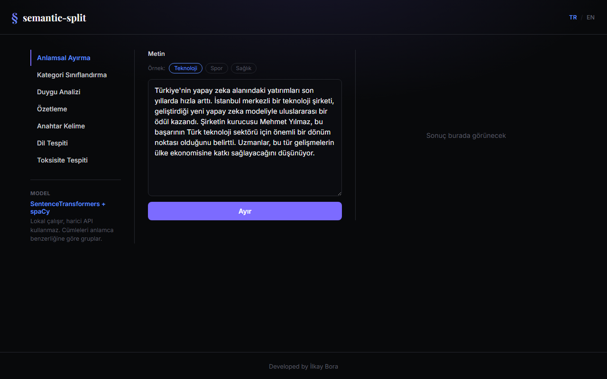
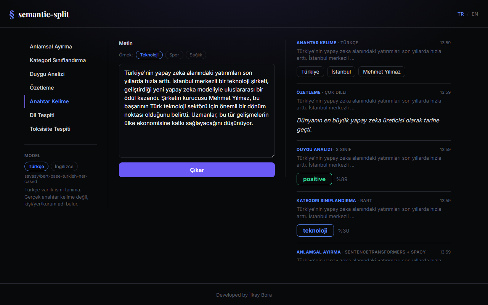
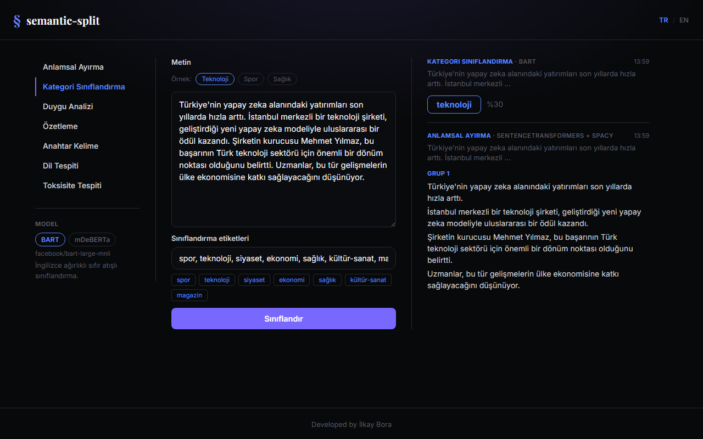

# semantic-split

**[English](#english) | [Türkçe](#türkçe)**



**Live demo:** https://semantic-split-ilkaymbs-projects.vercel.app

---

## English

A small Vue 3 + Django playground for text analysis. Paste a paragraph and run it through seven different NLP operations, each powered by a Hugging Face model (except semantic splitting, which runs entirely locally). Several operations let you switch between two different models on the same text and compare results side by side.

### Features

- **Semantic Split** — groups sentences by meaning using `sentence-transformers` + spaCy, fully local (no external API call).
- **Category Classification** — zero-shot classification with user-defined labels (`facebook/bart-large-mnli` or `MoritzLaurer/mDeBERTa-v3-base-mnli-xnli`).
- **Sentiment Analysis** — 3-class positive/neutral/negative, or 1-5 star rating (`cardiffnlp/twitter-xlm-roberta-base-sentiment` or `nlptown/bert-base-multilingual-uncased-sentiment`).
- **Summarization** — multilingual or English-tuned (`csebuetnlp/mT5_multilingual_XLSum` or `facebook/bart-large-cnn`).
- **Keywords** — named-entity extraction in Turkish or English (`savasy/bert-base-turkish-ner-cased` or `dslim/bert-base-NER`).
- **Language Detection** — `papluca/xlm-roberta-base-language-detection`.
- **Toxicity Detection** — multilingual or a more detailed English model (`citizenlab/distilbert-base-multilingual-cased-toxicity` or `unitary/toxic-bert`).

Other bits: a bilingual UI (Turkish/English, auto-detected from the browser, manually toggleable), quick-fill example texts, and a scrollable run history so you can compare results across operations and models without losing earlier runs.

### Screenshots

| Run history (multiple operations) | Model comparison |
| --- | --- |
|  |  |

### Stack

- **Frontend**: Vue 3, Vite, plain CSS (no UI framework) — deployed on Vercel
- **Backend**: Django, calling the Hugging Face Inference API over HTTP — deployed on a self-managed Hetzner VPS (nginx + gunicorn + Let's Encrypt)
- **Split logic**: [`semantic-split`](https://github.com/agamm/semantic-split) (SentenceTransformers + spaCy), the original idea this project is built around

### Running locally

You'll need a free [Hugging Face access token](https://huggingface.co/settings/tokens) (fine-grained, with "Make calls to Inference Providers" permission).

#### Backend

```bash
cd server
python -m venv .venv
.venv/Scripts/activate        # Windows; use `source .venv/bin/activate` on macOS/Linux
pip install -r requirements.txt
python -m spacy download en_core_web_sm

cd backend
cp .env.example .env          # then edit .env and add your HUGGINGFACE_API_TOKEN
python manage.py runserver
```

#### Frontend

```bash
cd client
npm install
npm run dev
```

Open `http://localhost:5173`. The backend is expected at `http://127.0.0.1:8000`.

### Notes

- The semantic-split step is language-agnostic in principle but currently uses an English spaCy sentence splitter (`en_core_web_sm`), so sentence boundaries on non-English text may be imperfect.
- Free-tier Hugging Face Inference API calls can have a cold-start delay (a few seconds to ~20s) on the first request to a given model.

---

## Türkçe

Metin analizi için küçük bir Vue 3 + Django oyun alanı. Bir paragraf yapıştır, yedi farklı NLP işleminden geçir; anlamsal ayırma dışındaki her işlem bir Hugging Face modeliyle çalışır (ayırma tamamen lokal çalışır, harici API kullanmaz). Bazı işlemlerde aynı metin üzerinde iki farklı model arasında geçiş yapıp sonuçları yan yana karşılaştırabilirsin.

### Özellikler

- **Anlamsal Ayırma** — `sentence-transformers` + spaCy ile cümleleri anlamca gruplandırır, tamamen lokal çalışır (harici API çağrısı yok).
- **Kategori Sınıflandırma** — kullanıcı tanımlı etiketlerle sıfır atışlı sınıflandırma (`facebook/bart-large-mnli` veya `MoritzLaurer/mDeBERTa-v3-base-mnli-xnli`).
- **Duygu Analizi** — 3 sınıflı pozitif/nötr/negatif ya da 1-5 yıldız puanlama (`cardiffnlp/twitter-xlm-roberta-base-sentiment` veya `nlptown/bert-base-multilingual-uncased-sentiment`).
- **Özetleme** — çok dilli veya İngilizceye özel model (`csebuetnlp/mT5_multilingual_XLSum` veya `facebook/bart-large-cnn`).
- **Anahtar Kelime** — Türkçe veya İngilizce varlık ismi tanıma (`savasy/bert-base-turkish-ner-cased` veya `dslim/bert-base-NER`).
- **Dil Tespiti** — `papluca/xlm-roberta-base-language-detection`.
- **Toksisite Tespiti** — çok dilli veya daha detaylı bir İngilizce model (`citizenlab/distilbert-base-multilingual-cased-toxicity` veya `unitary/toxic-bert`).

Diğer detaylar: iki dilli arayüz (Türkçe/İngilizce, tarayıcıdan otomatik algılanır, elle de değiştirilebilir), hızlı doldurma için örnek metinler, ve önceki sonuçları kaybetmeden işlemler ile modelleri karşılaştırabileceğin kayan bir çalıştırma geçmişi.

### Ekran Görüntüleri

| Çalıştırma geçmişi (birden fazla işlem) | Model karşılaştırması |
| --- | --- |
|  |  |

### Teknoloji

- **Frontend**: Vue 3, Vite, sade CSS (UI framework yok) — Vercel'de yayında
- **Backend**: Django, Hugging Face Inference API'yi HTTP üzerinden çağırıyor — kendi yönetilen bir Hetzner VPS'te yayında (nginx + gunicorn + Let's Encrypt)
- **Ayırma mantığı**: [`semantic-split`](https://github.com/agamm/semantic-split) (SentenceTransformers + spaCy), bu projenin üzerine kurulduğu orijinal fikir

### Lokal Çalıştırma

Ücretsiz bir [Hugging Face erişim token'ı](https://huggingface.co/settings/tokens) gerekiyor ("Make calls to Inference Providers" izinli, fine-grained token).

#### Backend

```bash
cd server
python -m venv .venv
.venv/Scripts/activate        # Windows; macOS/Linux'ta `source .venv/bin/activate`
pip install -r requirements.txt
python -m spacy download en_core_web_sm

cd backend
cp .env.example .env          # sonra .env dosyasını düzenleyip HUGGINGFACE_API_TOKEN'ını ekle
python manage.py runserver
```

#### Frontend

```bash
cd client
npm install
npm run dev
```

`http://localhost:5173` adresini aç. Backend'in `http://127.0.0.1:8000` adresinde çalışması bekleniyor.

### Notlar

- Anlamsal ayırma adımı prensipte dilden bağımsız olsa da şu an İngilizce bir spaCy cümle bölücü (`en_core_web_sm`) kullanıyor, bu yüzden İngilizce olmayan metinlerde cümle sınırları kusurlu olabilir.
- Ücretsiz Hugging Face Inference API çağrılarında, bir modele yapılan ilk istekte soğuk başlangıç gecikmesi olabilir (birkaç saniyeden ~20 saniyeye kadar).

---

Developed by [İlkay Bora](https://ilkaybora.com)
